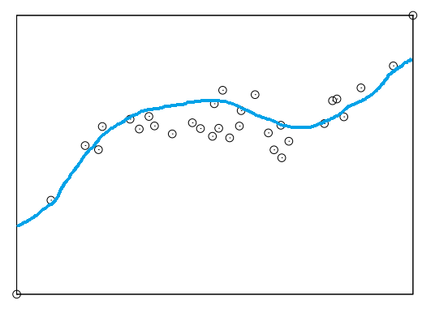
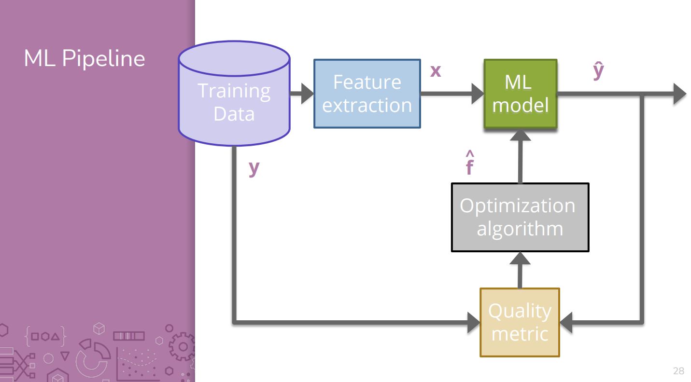
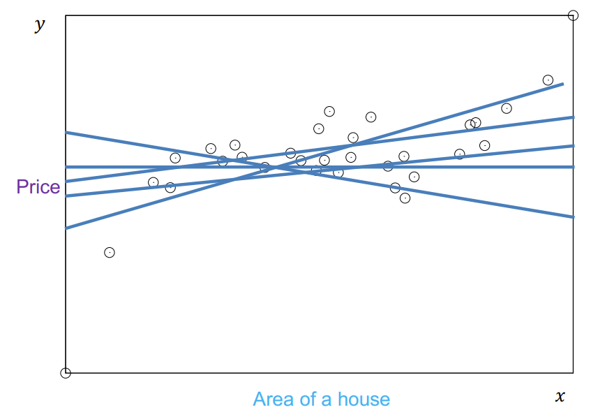
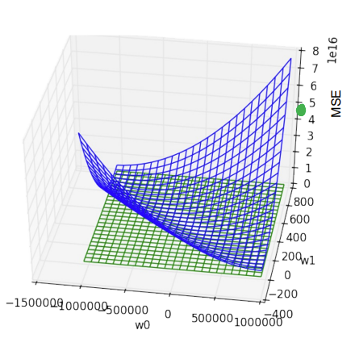
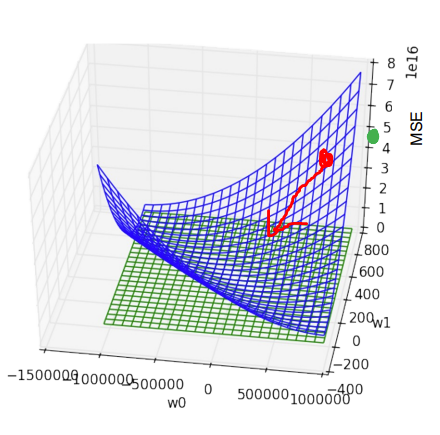
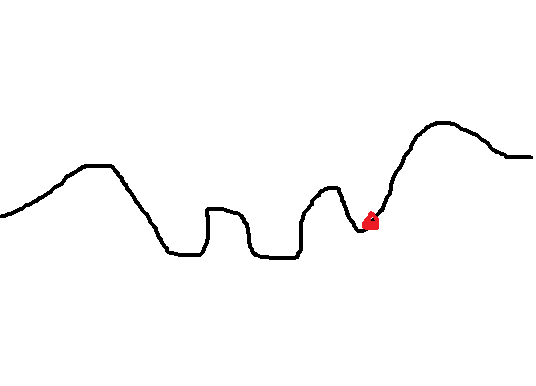
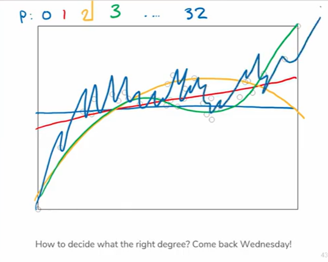
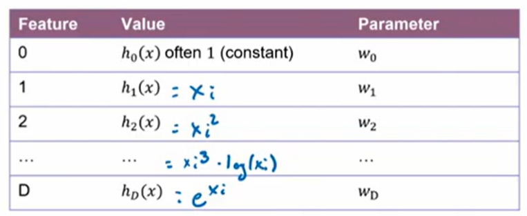
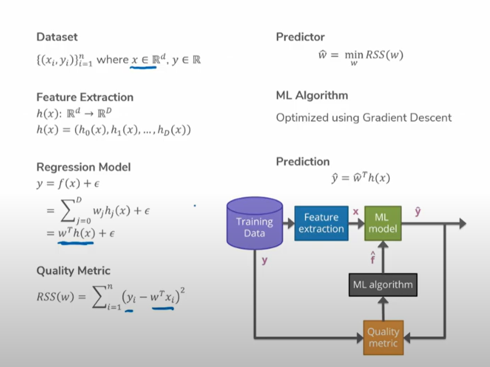

# Lecture 1.1 - Introduction
Machine Learning is becoming increasingly popular in recent years, businesses especially have adopted it at a rapid pace. Not just business, but credit deals, drug prescriptions, vaccine distributions, and parole decisions.

## What is Machine Learning?
> **Machine Learning** is the study of algorithms that improve their performance at some task with experience.

The above definition is derived from a guy named Tom Mitchell in 1998 who defined Machine Learning as something stupid complicated.

Every Machine Learning model is imperfect -- models introduce imperfection in service of speed or space.

## The Three Main Camps of Machine Learning
### Supervised Learning
* Training data is labeled, inputs paired with correct outputs
* Model infers the mapping function from an input to an output
* Examples: image classification, stock price predictions

### Unsupervised Learning
* Analyze and cluster unlabled datasets
* Discover patterns or categorizes without humans
* Examples: DNA clustering, anomaly detection 

### Reinforcement Learning
* *Not Covered in CSE 416*
* See AI in Games for Reinforcement Learning

## Course Overview
| Subject | Case Study |
| - | - |
| Regression | Predicting House Prices |
| Classificaiton | Sentiment Analysis |
| Document Retrieval | Related News Articles |
| Recommender Systems | Recommending Purposes |
| Deep Learning | Image Recognition |

## Machine Learning Course Landscape
| Course | Description |
| - | - |
| CSE 446 | Machine Learning for CSE Majors |
| STAT 435 | Machine Learning for Stats Majors |
| CSE/STAT 416 | Machine Learning for Everyone Else (you!) |

The purpose of 416 is to give a broad overview of Machine Learning, without the hardcore mathematical/statistical fuss.

## Course Structure
* Lecture: Introduces concepts, brief exposure
* Sections: Build upon concepts, prepare for assessments
* Homework: Practice concepts, master content

Small checkpoint quizzes allow you to test your understanding of concepts every day. Checkpoints are due 30 minutes before the next lecture.

Learning Reflections allow you to submit notes or other materials.

A few extra credit opportunities exist.

## Class Checklist
1. Watch Pre-lecture Materials
2. Complete Checkpoint (if you haven't already)
3. Watch lecture
4. Go to section
5. Turn in weekly deliverables

## Assessments
### Homework
* About 9 assessments, lowest dropped
* Pair submission (or individual)
* Consists of a programming part (coding) and conceptual part

### Checkpoints
* 20 checkpoints, lowest 3 dropped

### Learning Reflections
* 10 submissions, for completion

### Midterm + Final
* Open handwritten notes allowed
* Details TBD 

### Extra Credit
* Exists, details TBD

## Homework
* 6 free late days, valid for any assignment
* 2 late days can be used per assignment
* Learning reflections and checkpoints turned in up to a week late receive 50%
* Collaboration allowed between partners, but not between the entire class
* All submissions are on Gradescope, all checkpoints are on EdStem

## Questions
* Ask on EdStem
* Ask in office hours or form a study group

# Lecture 1.2 - Regression and Housing Prices
What are the factors of determining the price of a house? There a number of things, including location, number of bedrooms, number of bathrooms, square footage, etc. etc. But what features should we pay attention to if we wanted to train a Machine Learning model?

> Goal: Given a house, predict how much it's worth.

We have something like the following data:
| Sq Ft | Price |
| - | - |
| 2318 | 315k |
| 1985 | 295k |
| 2861 | 370k |

If we assume that `Sq Ft (x)` has some relationship to `Price (y)`, we can define their relatinship as:

> y = f(x)

Where `x` is the input data, and `y` is the output, target, label, or some other.

A **model** is how we assume the world works. For instance, if we plotted `Sq Ft` against `Price` on a graph, it might look like a scatterplot. If we assume that there is some relationship between our `x` and our `y`, we can form a regression model.

So we need to learn some `f` that can predict some `y` value given an `x`. This could be a linear line, a curve, quadratic, or something else. That's a decision you need to make yourself.

## The ML Pipeline

## Regression
**Regression** is a supervised learning algorithm that uses a set of known training data examples with known labels. The goal is to establish some relationship between an input and an output.

In **linear regression**, we assume the relationship between the two variables can be modeled by a linear equation. The line takes the form

> `y = x_i(a_i) + b_i`

Where `y` is some prediction, `x` is some input, and `a_i` is a weight and `b` is a bias. For instance, if we guessed a bunch of random lines:

### Loss Function
There is some line in there that probably fits the data better than others. To find out which one, we need a **Cost or Loss Predictor**. A typical one to use is **Mean Squared Error (MSE)**. Mean Squared Error is generally a good default choice, but alternatives exist.

> Mean Squared Error will increase based on how far each point is from its actual value, exponentially. Larger errors will generate exponentially larger error.

### Optimization Algorithm
The goal of the optimization algorithm is to minimize the loss function. In the most primitive sense, the optimization algorithm will, for every possible `a` and `b`, find the pair that results in the lowest cost. Here's a graph of `a` and `b`, plotted against `MSE`.

Of course an algorithm that tests every possible `a` and `b` is impractical, so we use **gradient descent** allows us to use a random `a` and `b` and find the direction we should go to decrease error.

Don't do the math yourself, that's some PHD shit. But for reference, the equation is:

> `w -= a(dL)(w)`

Where `a` is the **learning rate** of the function.

There are a few problems with gradient descent, namely, if the MSE graph isn't a convex function.

### Feature Extraction
In cases that a linear function doesn't accurately model the relationship of the data, we can use a related model to model relationships of higher powers. This is referred to as **polynomial regression**.

> `y = a + bx + cx^2 + dx^3 + ...`

| Feature | Value | Parameter |
| - | - | - |
| 0 | 1 | a |
| 1 | x | b |
| 2 | x^2 | c|

Therefore, the question then becomes how many degrees is appropriate to use:

But we'll save that for later. For now, what if instead of just increasing the power of x, we actually transformed it in some way instead?

> `y = a * h_0(x) + b * h_1(x) + c * h_2(x)`

Where any `h_i()` can be any function. Common ones are just x, square, log, etc. etc, whatever you think might work.

But in reality, we usually have more than one kind of input, and transforming the same input over and over might not produce helpful results. Instead, if we have access to other inputs (in the case of a house, say, the number of bedrooms or bathrooms) we can introduce those into the regression model as well.

> `y = a + b(square footage) + c(# bathrooms) + d(# bedrooms)`

`a, b, c, d` are still the parameters of the various inputs. One can even play with the parameters to see which features have the greatest effect on the output, but that's for later.

> Data Inputs != Features. Data inputs are provided in the data, which are processed to be turned into features which are fed into a model.

## Recap
