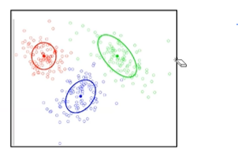
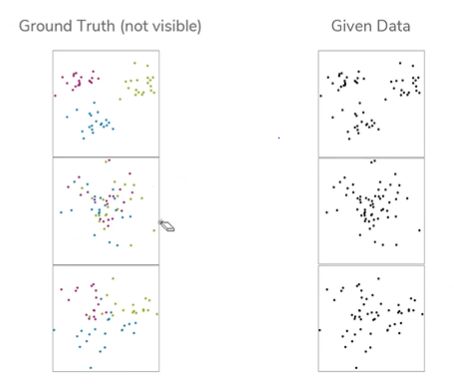
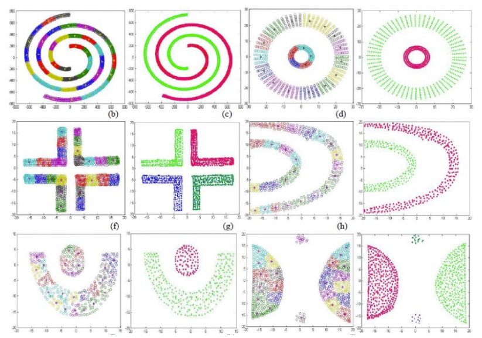
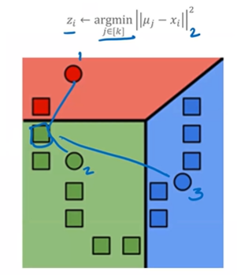
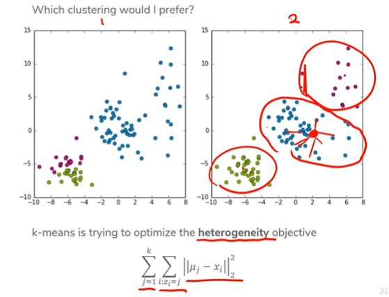
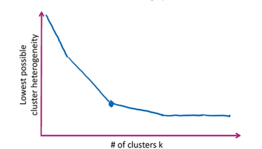
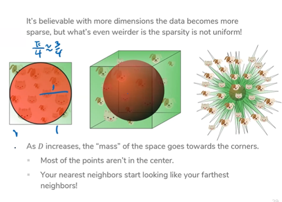

# Lecture 11 - Clustering
Imagine we want a news recommendation system. We have a number of articles, and want to categorize them into separate topics. Except we don't have a list of topics.

**Clustering** is the process of trying to group related points in a dataset. It belongs to the unsupervised learning camp.

A **cluster** is defined by a **midpoint** (which may not be a real point) and its **spread** (the area which expands about the midpoint).



The problem is to find where to place midpoints, and assign points to groups based on the closest midpoint. Closest is defined by your chosen distance function (we're gonna use euclidian to avoid migranes).

Clustering can be hard. Nature doesn't always lend itself to this closest neighbor stuff. But we'll focus on what we can achieve with this approach so far.





## K-Means Clustering
K-Means Clustering attempts to identify `k` centroids, and assign each point to the closest centroid. First, to define a score (how well a point fits into a given cluster), we can define it as the distance.

```
Score = distance(x, centroid)
```

Once we have that, we can assign points to centroids. That process means:

1. Assign point to closest midpoint
2. Update midpoint of cluster to average of all points in cluster
3. Repeat until no points remain

As for initialization, we can choose random points as starting centroids, but in practice you can use points from the dataset.



To see this in action, you can try it [here](https://www.naftaliharris.com/blog/visualizing-k-means-clustering/).

The algorithm will **converge** when no points change their assignment, or when a maximum number of iterations has been achieved.

Clustering is largely affected by the initial state of the midpoints. 

## K-Means++
Because k-means' performance depends largely on the initial positioning of the centroids, we can choose to initalize centroids as far as possible from each other. Repeat until all centroids have been placed. This improves the quality of local minima and converges faster, but it can be more computationally expensive.

## Assessing Performance
When assessing the performance of clustering algorithms, we take the distance of all points to their respective centroids. The clusterings with the least distance between each point and its associated cluster is the best clustering.



The *heterogenity* of a graph refers to how different two given points in a cluster are from each other. As `k` increases, heterogenity decreases with diminishing returns.



## The Curse of Dimensionality
As dimensions grow large, k-NN and k-means suffer. This is because with more dimensions, the richness, or amount of information in each dimension, falls. Don't worry about it.



Weird stuff also happens if n < D.