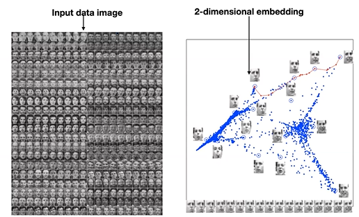
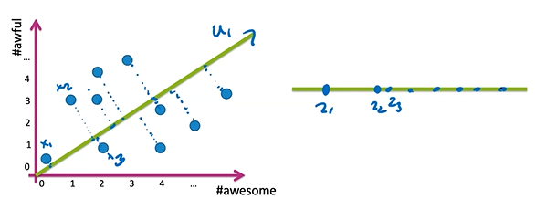
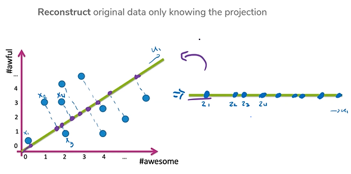
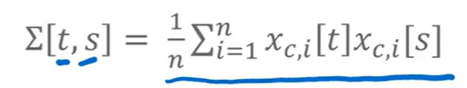
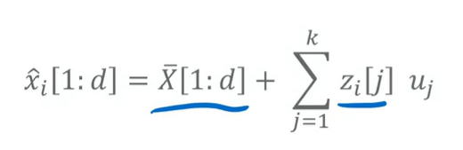
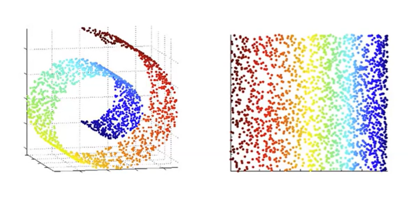

# Prelecture 13 - Recommender Systems
The basis for recommendation systems is the functionality to serve personalized recommendations of some content to a user, based on their preferences.

For our purposes, we're going to be using movies as our case study.

## The Challenges of Recommendation Systems
### Feedback
When creating a recommendation system, there are two types of feedback a user can give you:

> Explicit: Asking the user directly about their likes, such as ratings or reviews

> Implicit: Using metrics about the user, such as time or click rate

### Redundancy
Another issue is of redundancy. If a user liked Rocky 1, for instance, the recommendation system might also recommend Rocky 2 3 4 and 5 as well. This may not be the best set of recommendations to give a user.

### Cold Start
Another issue is cold starts. When a piece of content is first introduced, no user information about that piece of content exists yet. Usually, other data surrounding the movie is used, such as genre, actors, and if it's a sequel.

### Time
Tastes and styles vary over time. Depending on the year, season, or even trend, recommendations can go in or out of date.

### Scalability
There are many users and many movies. Calculations for recommendation system must be efficient such that they are servable to massive audiences.

## Solutions So Far
### Popularity
Simple solution is to recommend the most popular movie. This solution is easy to implement, but no personalization and can lead to feedback loops.

### Classification Models
Another solution is to use a classification model to classify whether a user would like a given movie or not. Using a feature space that includes data about a user and a movie, try to predict whether the user would like the product. Sort all movies by their likelihood and recommend the top k ones.

This approach is very flexible, personalized, and can handle very complex contexts (time, limited user data, recent history, etc.). But the features can be hard to work with, and doesn't work well in practice when compared to more advanced techniques, and still leads to feedback loops.

# Lecture 13 - Dimensionality Reduction & PCA
Before getting to recommender systems, we're going to discuss the problem of dimensionality. This will be a key concept in a recommender system we discuss later.

The concept of dimensionality is one of information spaces. For instance, a dataset of faces, with resolutions of 16x16, can be represented many different ways. One way can be to assign each pixel of a 16x16 image to an array of size 256. In other words, 256 dimensions.

But that's a lot of dimensions and not a lot of information. What if there was a way to extract information from the data, that isn't so explicit, but still preserves some information that's learnable?

Therefore, **the primary goal of dimensionality reduction is to represent the meaning of the data with as few dimensions as possible**.

> Dimensionality Reduction is the task of represneting data with a fewer number of dimensions while keeping meaningful relations in the data

## Principle Component Analysis
PCA or Principle Component Analysis is a very popular algorithm. It uses a linear projection from a d-dimensional space to a k-dimensional space that minimizes reconstruction error.

Basically, if you were to pick only k dimensions from a set of d dimensions, and tried to reverse the process, which set of k would lead to the least errors?

### Linear Projections
One popular approach of feature reduction is to use features that are combinations of other features. A simple idea of this would be turning a three dimensional datapoint (Year, Month, Day) into a single dimension (UTC timestamp). 

Given dataset `x` and projected dataset `z`:

> `z[i] = f(x[i])`

This can be done without labels, in an unsupervised learning environment. Once this is done, we can pick the transposition that produces the least error. This is illustrated like the following:

### The Algorithm
To perform PCA, one starts with an `n x d` data matrix, `X`. Each row of `X` is an example.

1. Center the data about the mean. Take the mean of the entire dataset and subtract the mean from each row.
2. Compute the spread/orientation. This number will tell you how related two given features are.

3. Compute the eigenvectors for the entire dataset, and select the k largest eigenvalues. Most libraries include functions to calculate eigenvectors.
4. Project data using the largest eigenvector(s).

To reconstruct the data, reverse the eigenvector transformation, and readd the mean.

## Scaling PCA
Finding these principle components can be very slow for very large feature spaces. Another algorithm, Singular Value Decomposition (SVD), is a very fast version that works as a good substitute.

PCA can also fail when there isn't a good linear subspace that can represent the data well. For instance, the swiss roll:

Non-linear dimensionality reduction such as Manifold Learning and SDD maps, Isomap, LLE, and t-SNE exist for these purposes.