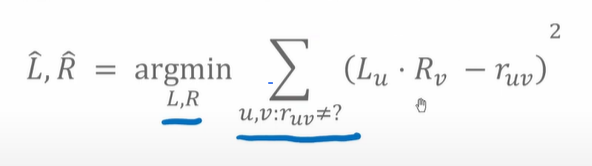

# Prelecture 14.1 - Recommender Systems
Previously, we introduced the idea of recommender systems. Our naive model, the Popularity Model, simply recommended the most popular movie. The Classification Model predicted how likely a user was to like a given movie. We're going to introduce another model, the co-occurrence matrix.

## Cooccurrence Matrix
The basic idea of a co-occurrence matrix is that people who like one thing also like other things. In other words, if a user buys diapers, they may also buy baby wipes.

Imagine we have an `m x m` matrix `C`, where each `[i, j]` is the coincidence of two products. Each row is an item, each column is an item.

Then, for a given item, find out what products have the largest coincidence.

An issue is that very popular items (say, toilet paper) might be weighted too highly. To fix this, we can normalize the counts using **Jaccard similarity**.

This provides the number of times both `i` and `j` are bought divided by number of times `i` is bought and number of times `j` is bought.

We can also get recommendations for multiple items, if we average the similarities of multiple items:

The co-occurrence matrix is great because it is personalized to a history, but it does not utilize context, user features, or product features. It is also hard to scale when m grows large, and still has the cold start problem.

# Prelecture 14.2 - Matrix Factorization
Matrix Factorization is a fancier system. Using our metaphor of a movie recommender, let's assume with have the user ratings of a given subset of movies. Because this is the real world, the user has probably only rated a small subset of all available movies.

Now represent that user's ratings as an array of data. Then take all the users and their ratings and form a matrix. We now have a matrix of users to their ratings for each movie, with a lot of empty spaces.

Our goal is to now fill in the missing squares, and use those predicted values to recommend movies to a user. Note that this problem is an impossible task without the following assumptions:

1. Movies can be grouped into `k` subsets, which a user is interested in
2. A movie can be represented as a vector `R_v`, which represents how much a movie belongs to each of the k subsets
3. Each user can be described as a vector `L_u`, which represents how much au ser likes each of the k subsets

An example of this type of matrix with `k = 2` might look like:

Once we have the two matricies of movie grouping and user likeness, we can matrix multiply them to find a movie whose groupings best match a user's likeness:

The resulting matrix can be compared to our existing data to measure fitness.

The quality metric equation is least-squares error, with some exceptions where data is missing.

# Lecture 14 - Recommender Systems
## Coordinate Descent
Once we have the quality/fitness metric, we now need to perform some sort of optimization. Gradient descent is a little hard wih two vectors, so instead, **coodinate descent** is used instead. Essentially, the `L` and `R` matrices are optimized in alternating fashion. This looks like a step-wise optimization.

In this form, coodinate descent can be used in place of gradient descent in any of our previous applications.

For our movie matricies, we can optimize the movie matrix for each user. This results in a movie matrix that is optimized for each user.

This can also be done in the other way, by holding users constant, we can solve the movie matrix. In short,

## Using Results
Once we have both matricies, we can use both `L` and `R` to find a movie's genres that best match the user's preferences.

This concept is generalizable to finding concepts for given items. For instance, we could swap out movies with songs, books, or TV shows.

## Issues Remaining
Matrix Factorization still does not solve the context or cold start problem. While it is personalized, it doesn't have the facilities to handle either contextual data or cold starts.

## Blend Models
To help alleviate the cold start problem, we can create a sort of "global taste". This customized user vector is the sum of all user vectors, which hopefully represents what is popular for everyone right now.

This is a global model. We can use this user vector to find a movie that best matches the preferences of all users. Useful if there is no information about a given user.

This can also be applied when we have sparse user data. For instance, we can start a user off with the global vector, but start building a user vector that deviates from the global model. The recommendations will weigh the user's personalization with the global vector, depending on how rich the user vector is.

More specific generalized vectors can be created for given demographics, including age, gender, etc.

## Evaluating Recommendations
Since we're concerned with finding what a user likes instead of dislikes, we can view the recommendation models through a lens of precision and recall. 

As more recommendations are given, generally precision goes down. You generally aim to make recall as large as possible.

When comparing algorithms, we can use several metrics, including area under the curve (AUC) or desired recall at precision `k`.