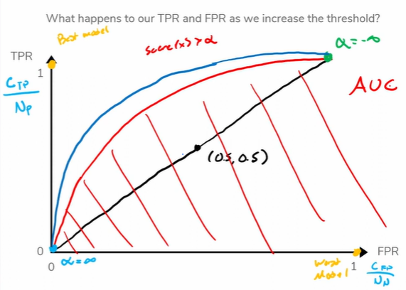

# Prelecture 15 - Precision & Recall
Remember that in a given recommendation task, we have a certrain threshold that determines whether a sample is predicted to be a positive or negative. Changing that threshold has an effect on the True Positive Rate and the False Positive Rate that are related.

## Assessing Accuracy of Recommendations
There are two important terms we use to describe accuracy of models.

> **Precision**: The number of positive predictions that were truly positive out of all positive predictions

> **Recall**: The number of positive samples correctly predicted as positive out of all positive samples

In other words, let's say we predicted 10 of our 15 predictions as positive. If we reveal the answers and find that only 8 of those 10 were actually positive, our precision will be 8/10, or 80%.

Conversely, if we had 11 positive samples in the dataset, and we correctly predicted that 8 of those 11 were positive, our recall would be 8/11 or around 70%.

This means that models that tend to predict positively will have low precision, but high recall, and models that predict negatively will have high precision, but low recall.