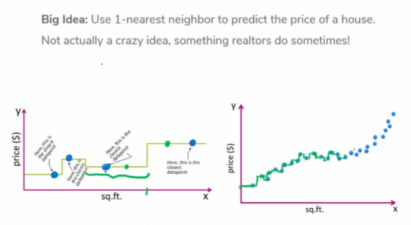
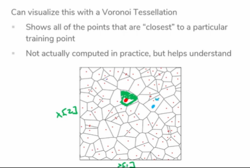
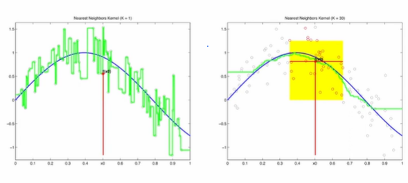
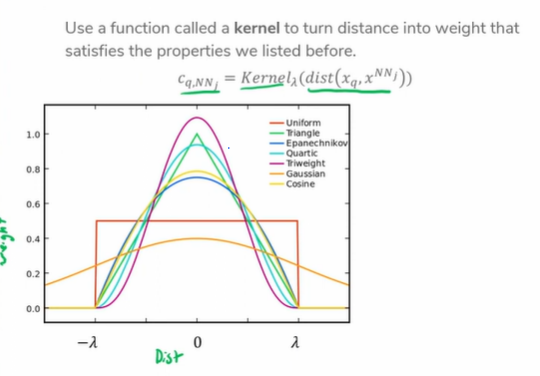
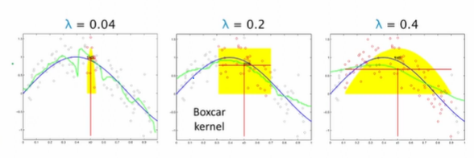

# Prelecture 16 - Local Methods & Locaility Sensitive Hashing
Remember that precision is the number of positive predictions that were truly positive, and recall is the number of positive cases correctly predicted positive.

So far, we're been using an embedding and a similarity metric to find the nearest neighbor to some target book.

An interesting application of this model is to regression. For instance, if we were trying to predict the price of a house, if we find a house that has a price and has similar features, we can predict a price similar to that house.

This makes it so for any point A, its prediction is the closest neighbor's value.

One downfall is that when data is noisy, this model can overfit very easily. Therefore, instead of using the first nearest neighbor, we can use the average of k nearest neighbors.

K-Nearest can introduce oversimplification if k is too large, can introduce discontinuity, and boundaries of predictions may suffer.

One solution is to take a weighted average of the neighbors, based on their distance. We can turn all these conversions into a kernel. There are many different implementations:

All kernels are generally initialized with a hyperparameter lambda, which determines the boundary of the kernel.

# Lecture 16 - Kernel Methods, Locality Sensitive Hashing
Skipped!