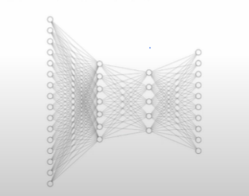
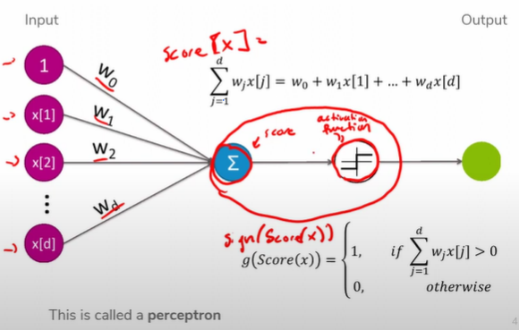
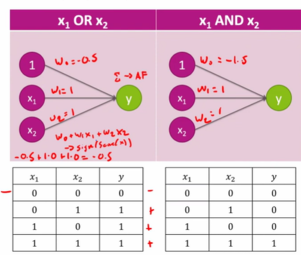
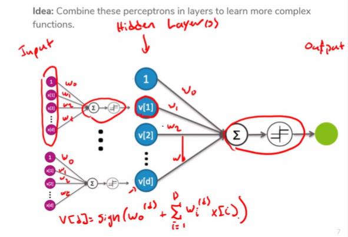
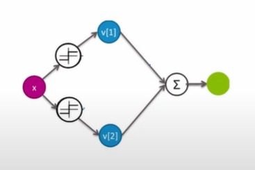
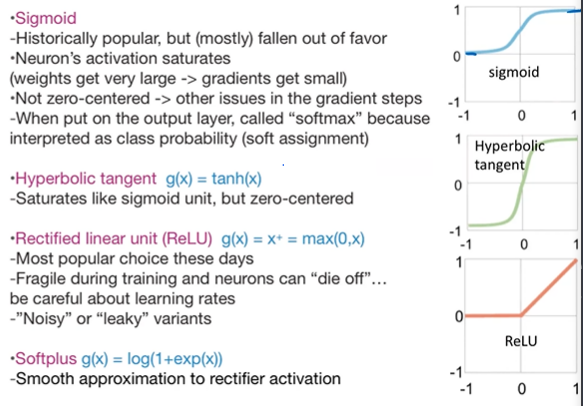
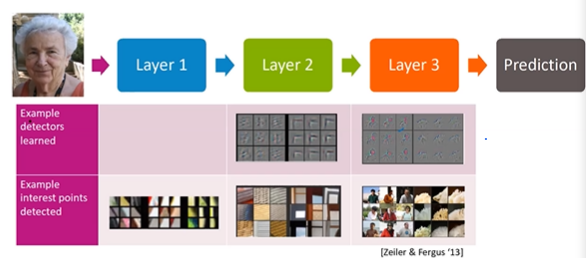
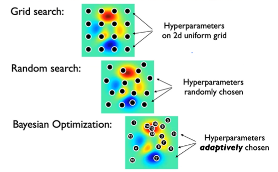

# Prelecture 17 - Deep Learning
## Neuron Basics
Deep Learning generally refers to a class of models that mimic the human brain. The term "deep" in the name comes from the various layers that these models are usually comprised of.

Recall from neuroscience that a neuron receives some number of inputs, and decide to output based on those inputs. In Deep Learning, a similar procedure is used.

For simplification, we organize these neurons into structures called layers.

Each neuron belongs to a layer. Each neuron in a given layer receives inputs from the previous layer, and outputs to the next layer.

Each neuron will take a weighted sum of each of its inputs. Then, the neuron's **activation function** will determine if the neuron should fire or not. The simplest activation function is the signum.

A single neuron can also represent a perceptron.

Using these structures, a weighted sum and activation function, we can learn a number of boolean logic operators. For instance, we can use a perceptron to learn OR and AND operators.

The 1 neuron is a dummy neuron to take in a constant. These boolean operators can be combined in tandem to learn more complex relationships, including XOR.

Layers that are in between the input and output are known as hidden layers.

## Multi-Layer NNs
What may come as a surprise is that in theory, a neural network with only a single hidden layer can learn any function, so long as there are enough neurons. As more neurons are introduced, more weights are introduced, the more detail can be represented.

# Lecture 17 - Deep Learning
Recall that each neuron takes a weighted sum and uses an activation function to determine whether to output or not. A dummy neuron that always outputs 1 will be learned as a coefficient. This dummy neuron is the **bias**, or intercept.

Each neuron will need to learn its own set of input weights, such that the final output of the network predicts accurately.

## Activation Functions
Generally, signum is not actually used as an activation function, because it is not differentiable and there is no notion of confidence. A signum neural network is actually equivalent to a regression, but different activation functions give deep learning its power.

Another activation is the sigmoid function. This is similar to signum in that it outputs from 0 to 1, but it is now differentiable and can show confidence. Sigmoid has fallen out of favor recently due to its nature to saturate quickly. Some alternatives are **hyperbolic** and **ReLU** functions. ReLU is the popular kid on the block right now.

Multiple activation functions can be used with different neurons, though it introduces more complexity.

## Neural Network Nature
Neural Networks were actually invented in the late 1900s, though simpler models at the time outperformed them. Recent advancements in technology and hardware made them more powerful.

Neural Networks are also not immune to overfitting. Overfitting can be mitigated by using more examples, or using fewer layers.

> **3-layer networks generally outperform 2-layer networks, but going deeper only helps if you're very careful**

NNs can also have regularization and dropout, where a parameter of a neuron might suddenly be dropped. Training can also be stopped early to prevent overfitting.

## NNs and Computer Vision
Let's imagine we're trying to create a facial recognition program. What rules constitute a face? Generally, we start with two eyes, a nose and mouth, but these features aren't comprehendable to computers. 

In the past, scientists hand-crafted features that could extract various features from an image, that could then be fed to a classifier to detect a face.

Now, we use neural networks. It was discovered that given a face, a neural network's layers began representing progressively more complicated features. For instance, the first few layers may represent edges and corners, but the latest layers may be learning eyes and mouths.

## Classification and Regression
Neural Networks are appropriate for regression and classification tasks. For regression, the output layer will generally be a single output neuron. For classification, the output layer will generally consist of one node per class.

> In classification tasks, the output layer will generally have logistic or "softmax" activations to turn scores into probabilities

## Training Coefficients
To make a NN learn, we need a quality metric and a cost function. For regression, we use RSS or RMSE, and for classification, we can use **Cross Entropy** loss.

Gradient descent works in this scenario, albeit with another step called backpropagation.

## Backpropagation
The idea of **backpropagation** is to make a prediction and feed the error back through the model to fine tune the prediction.

1. Do a forward pass of the data, getting a prediction
2. Compare the prediction to the true label
3. Backpropagate the error so the weights create better predictions

The actual details of the backpropagation are calculus-heavy, and are discusses by 3blue1brown that you already watched.

Because it's expensive to do this propagation for every sample, we split our data into batches and perform propagation on a per-batch basis. We can perform this batched data processing multiple times over the entire dataset, which are denoted as **epochs**.

Don't expect to do this yourself, the libraries generally do this for you. The number of epochs and the batch size are up to you to decide.

## Neural Network Hyperparameter Optimization
There are many undecided hyperparameters about a network. These include:

* Number of layers
* Activation function
* Learning rate 
* Batch size
* Epochs
* Etc.

There is not much theory around how these hyperparameters are chosen yet. It's up to you to decide for your application what decisions are made, because this is an ongoing research problem.

> Optimizing hyperparameters for Neural Networks is an ongoing research problem.

Grid Search can work for hyperparameter optimization, but generally doesn't perform well because it's akin to brute force. Alternatively, there is random search, which randomly chooses a set of hyperparameters, and Bayesian optimization, which is random plus a bit of direction.

In general, models are written such that these hyperparameters are modular and many can be tested at a given time.

## Convergence
Neural Networks do not have convex loss functions. As a result, gradient descent can never really converge to an absolute min or max.

## Popular Deep Learning Libraries
* Tensorflow
* PyTorch
* Keras

# Tensorflow Playground
(https://playground.tensorflow.org/)[TensorFlow Playground]
