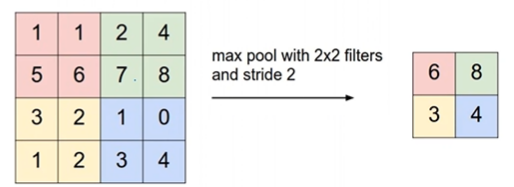

# Prelecture 18 - Convolutional Neural Networks
Convolutional Neural Networks are networks that are used particularly with image data. For example, if we have a 32x32 image, we could try inserting them into a network by flattening the image, or having each pixel in the image be an input to the model.

Color images also have three channels per picture, one channel for the colors Red, Green and Blue. We'll denote this using @. Therefore, an RGB image with 32x32 dimensions would be

> `3 @ 32x32`

This quickly faces issues with scale. For instance, a 3-channel image of 200x200 size has 120,000 input features. Depending on the number of neurons in hidden layers, the number of parameters needed to be learned quickly balloons to uncalculable.

## Convolutions
The idea behind convolutions is to combine pixels in a given area (say, 4x4) and reduce it to a single value.

This allows us to leverage the structure of an image. We make the assumption that nearby pixels are related. The window that we use to scan the image is known as the **kernel**. The kernel contains a series of numbers that we can use to calculate the reduction of an area of an image.

We perform this reduction for every position of the image. By changing the numbers inside the kernel, we can perform different operations on the image.

The neural network will learn these numbers, depending on the task. Kernels can be specified to have different dimensions, whether or not there is padding, or how far it should travel between values.

# Lecture 18 - Convolutional Neural Networks
Another similar operation to a convolution is pooling. 

> A pool operation combines local pixels using an operation (min, max, average)

This allows us to further reduce the pixel space from a convolution. A commonly used pool is max pool.

Commonly convolution layers are followed by a pooling layer.

## Convolutional Architecture
Convolutional layers and pooling layers are combined together, sometimes repeated, then fed into a neural network.

The number of convolutional-pooling layers is a hyperparameter. The neural network at the end of the network now only has to learn the feature space of the final convolutional-pooling layer.

## Higher Channel Images
The examples thus far have been for a black-white image, but if an image has more channels, a kernel of N dimensions can be used.

A **tensor** is another name for a matrix of some arbitrary dimension.

## CNNs Architectures, In General
CNNs are commonly set up with a bunch of convolutional layers, maybe followed by an activation layer, followed by a pooling layer. This process is repeated an arbitrary amount of times, before being fed into a neural network with a classification or regression task.

## Pros and Cons
CNNs and other deep learning techniques have benefitted several fields extraordinarily from these tasks, including:
* Image recognition
* Natural language processing
* Speech recognition

But it does come with drawbacks:
* Requires extremely large amounts of data
* Very expensive computationally (financially, energy, etc)
* Hard to impossible to tune hyperparameters
* Still not interpretable

## Transfer Learning
Sometimes, CNNs built for certain tasks can transfer certain parts of their learned layers to other tasks. For instance, a CNN model trained to distinguish cats and dogs contains layers near the beginning that could be used for edge/corner detection.

## Fragility
NN models are fragile. Adding random noise to images can skew recognition algorithms considerably. NNs can be tricked into predicting wrong answers. This can be leveraged by hackers and attackers.

## Further Reading
Recurrent Neural Networks
Long Shirt Term Memory Nets
http://colah.github.io/posts/2015-08-Understanding-LSTMs/

Reinforcement Learning
(Google DeepMind)[https://deepmind.com/blog/alphago-zero-learning-scratch/]

General Adversarial Networks
(How to learn syntetic data)[https://skymind.com/wiki/generative-adversarial-network-gan]