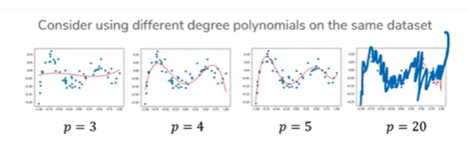
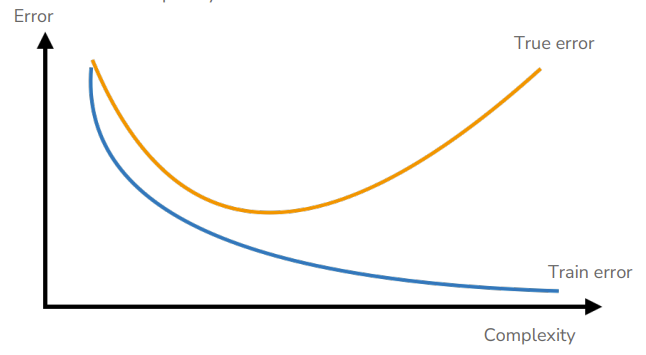
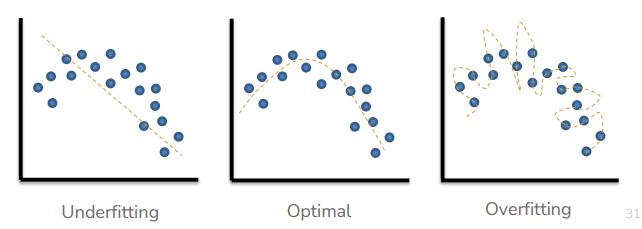
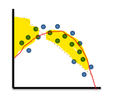
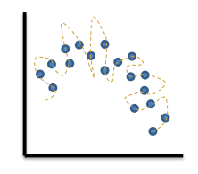
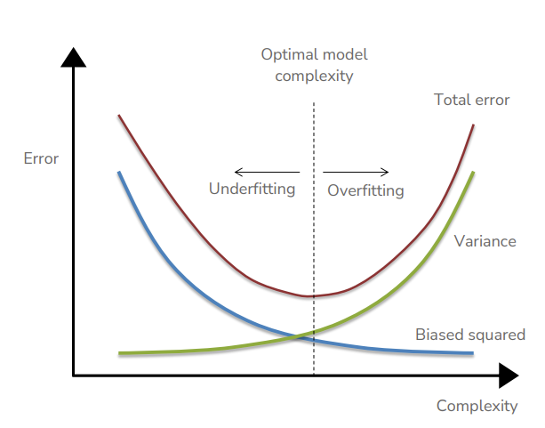
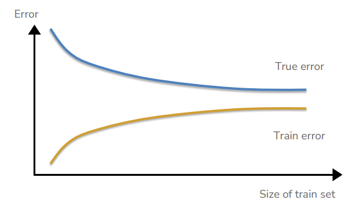
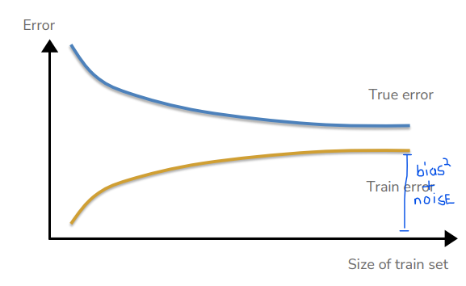
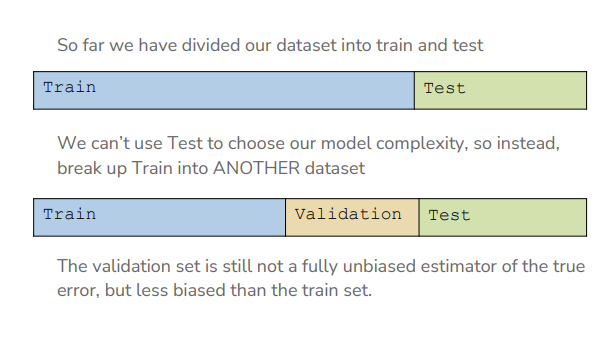
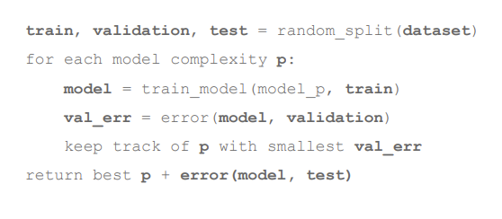

# Pre-Lecture 2: Assessing Performance
Usually, the residual sum of squares (RSS) loss function does a pretty good job. But a side effect of using RSS is that can introduce overfitting, where the model's polynomial perfectly hits every training point, resulting in a 100% training accuracy. This might not reflect the real world. This is the generalization/memorization problem.

## Future Performance
In the real world, a given input (like square footage) might result in many different outputs (many house prices). To fix this, we can define our own loss function to determine ourselves exactly how good or bad a guess is.

> `L(y, f(x))`

Where `L()` is our Loss Function, `y` is the true value, and `f(x)` is our prediction. The function will theoretically tell you how bad a prediction was, given the fact that there can be many different valid predictions for a given `x`. In other words, it makes getting a close prediction less painful. A **true loss** function will take into account a weight as to how likely a prediction is to occur in the real world, in theory. The problem is how such a function should be constructed.

## Model Assessment
One strategy is to hide a portion of our input data from the model when training, and then using that data to predict the "real world" performance of the model. This is referred to as the "train" and "test" data sets.

Evaluating the model using the test data, we can create a **test loss**, which is an approximation of the true loss.

One tradeoff is, however, that the more data you reserve for testing, the less data you have for training the model. So a decision needs to be made whether or not the sacrifice testing quality for model training quality. IN practice, it's generally 80/20 or 90/10.

# Lecture 2 - Assessing Performance
## Complexity and Fitness
When talking about ML models, there isn't a well-defined way to describe how complex a given model is. One commonly used metric is the nubmer of parameters a model has. For instance, a model with the following regression:

> `y = a + bx + cx + dx`

Has four parameters (a, b, c, d) that can be changed. Therefore, we say it is more complex than say, a linear one with only two parameters.

> `y = a + bx`

Deep neural networks tend to have millions or billions of such parameters. With so many parameters, training error is affected. It turns out, that with more parameters, a model is able to better fit its training data to its regression, resulting in a lower training error.

> **The more parameters/complexity, the lower the training error.**

However, the more parameters that are introduced, the less generalizable the model becomes. The true error will start high will too simple a model, and decrease to an optimal point, then begins to increase again as it gains more complexity.

> **As more complexity is introduced, the true error decreases, reaches a sweet spot, then increases**

When a model's true error is high because it isn't complex enough, we refer to it as **underfitting**. If the model's true error is high because it is too complex, we refer to it as **overfitting**.

## Bias-Variance Tradeoff
### Sources of Error
Sometimes error is introduced that we can't control. These types of error are referred to as **irreducible error**. For instance, noise can be introduced into the data during collection.

But there are 3 areas of total error we care about:
* Bias
* Variance
* Irreducible Errors (like noise, don't bother)

### Bias
**Bias** is the difference between the average prediction and the expected value. Bias here is highlighted.

Bias tends to be high when models are too simple. On the contrary, models with too high complexity tend to have low bias.

### Variance
**Variance** refers to the variability in the model prediction. In other words, if the model was trained on a different sample of data, the variance is how different the model would be.

Models that are too complex tend to have high variance.

> **All error is the sum of bias and variance. As a model grows more complex, bias starts high and tends to decrease, and variance starts low and tends to increase.**

> `Error = Bias Squared + Variance + Irreducible Error`

### Dataset Size
As datasets get larger, true error tends to decrease, but training error tends to increase. Imagine that with few data points, it's easy to fit a model accurately, but in the real world, the model will make many real errors. But with many data points, the model will find it hard to fit all the training data, but the real error will decrease.

Once true and training error converge, the resulting error is the bias plus the noise.

## Choosing Complexity
When choosing how complex a model to use, choosing a complexity with low training error will favor overfitting models. When choosing a complexity with low test error, **you violate the Machine Learning process**.

> If you choose a complexity based on test error, you essentially used your testing data as part of your analysis, invalidating its purpose to evaluate the effectiveness of your model.

### Solution 1: Validation Set
One solution is using a validation test. Reserve another subset of your data to be used as a validation set, and choose the complexity of your model based on how well it does on the validation set.

The validation process goes as follows:
1. Split data into training, validation, and test sets
2. Train a model with some level complexity
3. Get the validation error of the model
4. Keep track of which model has the smallest validation error
5. Keep track of which model has the smallest test error and smallest validation error

### Solution 2: Cross Validation
This will be covered in pre-lecture 3.