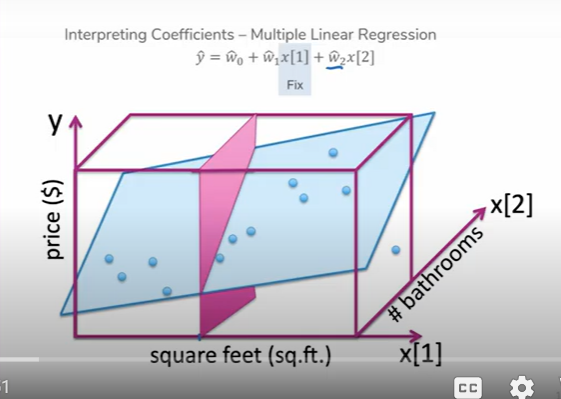

# Prelecture 3.1 - Cross Validation
Reminder that choosing a model with the lowest train error usually results in overfitting. Choosing a model on lowest test error invalidates the point of the test error. So we're exploring ways to prevent overfitting while not using train or test error. The first way was validation sets, and this one is **cross validation**.

## Validation Sets
Split the dataset into train, validation, and test sets. Train the model using the train set, validate using the validation set. This has the drawback of sacrificing training quality.

## Cross Validation
As a reminder, we use train and test sets to allow us to train then test our model. Setting aside the test data set, if we want to valdiate our model, we can train the model on different chunks of the training set, and use the other sections of the training set as validation sets, then repeat for each chunk.

Code for this is as follows:

This has the benefit of not sacrificing any training data, but now we're training `k` models, where `k = # of chunks`. For the best results, `k = n`, that is, one chunk per data point, but that's so slow nobody does that. So in practice people use `k = [5, 10]`.

# Prelecture 3.2 - Overfitting, Coefficients, and Regularization
## Coefficients
Coefficients in a linear regression are the terms a and b.

> `y = a + bx`

Interpreting what `a` and `b` are in the context of the problem is what coefficient interpretation is. When the number of coefficients grows greater, it can be useful to hold some coefficients constant to analyze the other coefficients. For instance, if we hold a coefficient constant in a `p = 3` regression, we get a slice:

With that slice, we can get a 2D graph:

This can tell us how a system changes if one coefficient is fixed. This can also be done with as many features you want by holding all but two coefficients constant. Note that this won't work if multiple coefficients use the same feature (for instance if a is square foot and b is square foot squared).

## Coefficients and Overfitting
When dealing with an overfit regression, the coefficients of your equation will be quite large.

> If the coefficients of a regression are large, it can be a sign of overfitting. Therefore, limiting the magnitude of a coefficient can be a method to prevent overfitting.

> Coefficients are sometimes written as a list, such as `w = [w1, w2, w3 ... wj]`

Overfitting can also occur if a model doesn't have enough features. For instance, a 2D model needs a few hundred points to prevent overfitting which is hard, but as dimensions increase, exponentially more data is needed to fill the gaps between. This is the **Curse of Dimensionality**. Will be reviewed later in the course.

## Preventing Overfitting
When trying to prevent overfitting, we can take a more retroactive approach compared to validation. One such way is regularization, which is the topic of today's class.

# Lecture 3 - Regularization
Up to this point, we've been using a loss function `L(w)` as a metric of quality, and been aiming to minimize it using a `w = argmin(L(w))`. This is how our regression is produced, but it also produces overfitting.

To balance this, we can introduce another function, `R(w)`, that measures the magnitude of coefficients. Our updated quality function looks like:

> `w = argmin(L(x)) + R(w)`

By adding the magnitude of the coefficients as a consideration for reweighing coefficients, we can restrain the model from creating coefficients that are too large. You can also add an additional coefficient, lambda, to determine whether the loss function or the magnitude has more effect on the overall adjustment:

> `w = argmin(L(x)) + Lambda * R(w)`

## Measuring Magnitude
How exactly R(w) measures the magnitude of coefficients is up to the implementation. A few commons ways are:

### Summation
> `R(w) = w1 + w2 + w3 ... = ||w||`

### Summation of Absolutes
> `R(w) = abs(w1) + abs(w2) + abs(w3) ... = ||w||`

### Sum of Squares
> `R(w) = sqrt(w1^2 + w2^2 + w3^2 ...) = ||w||`

All of these equations produce a regularization.

## Ridge Regression
Now that our updated quality metric looks like:

> `w = minarg(L(w)) + l * ||w||`

Formally:

Setting `l` to various numbers between 0 and infinity, we can weigh how much the quality metric cares about the normalization. That is, none or above all else. `l` is another of our **hyperparameters**.

## Hyperparameters So Far
| Hyperparameter | Description |
| - | - |
| Learning Rate | Used in gradient descent, how much to descend per step |
| Number of Iterations | Used in gradient descent, how many iterations to do before executing gradient descent |
| Regularization | Lambda as used in quality metric, how strongly the model should control the magnitude of its coefficients |
| Number of Folds | Used in cross validation, how many validation chunks to use |

## The Intercept or Bias
Helpfully, the intercept of a regression is also known as the bias. This bias is different than the bias in Bias and Variance. When going about regularization, *it doesn't make sense to perform regularization steps on the intercept*, because changing the intercept of a regression just moves it up and down, and doesn't play into fitness.

To exclude the bias from the regularization, you can change the quality metric to not include the intercept, or center all `y` values around a mean of 0, essentially removing the bias.

## Coefficient Scale
Let's imagine that instead of square feet, we change the unit to square meters. A given weight `w` would need to increase to compensate for the relative numerical decrease in the scalars of the unit (roughly a 3:1 decrease from feet to meters). This means units with relatively small scalars are penalized.

We can fix this issue by **normalizing** all units, such that units are compared on a scale of all available data. For instance, if the minimum square feet was 100 and the max was 10000, we would convert all square footages `x` as their relative positioning in `[100, 10000]`. More formally:

