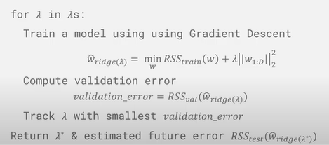
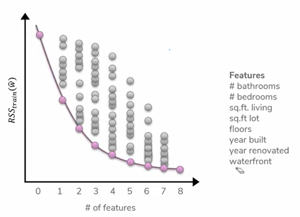
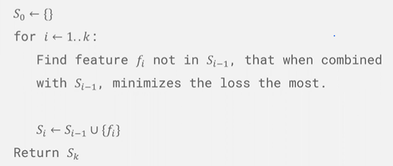
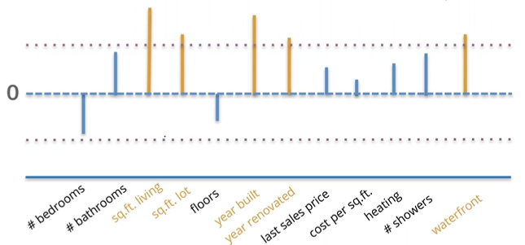
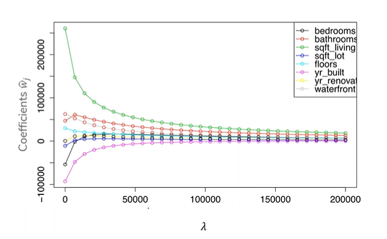
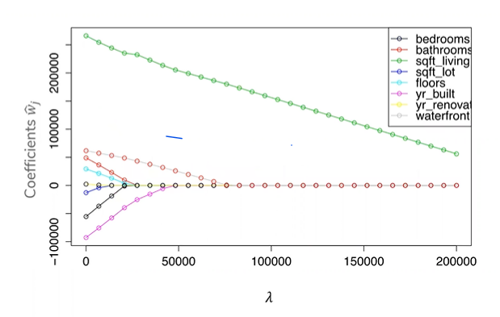
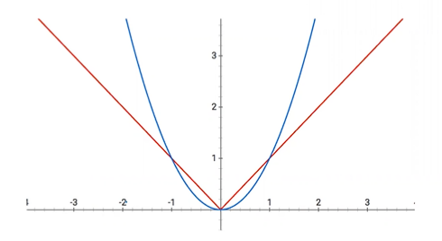

# Prelecture 4.1 - Regularization and Selecting Lambda
## Regularization Recap
Overfitting can occur with too complex a model with too small dataset, and with too many features with not enough dataset to get resolution on a pattern. We can tell if a model is overfitting when the coefficients of the model grow large.

Therefore, we developed a new quality metric that takes into account the size of the coefficients.

> `w = min(RSS(W)) + l * ||w||`

`l`, or lambda, is how much the coefficient term `||w||` affects the quality metric's output. If lambda is 0, then it has no effect, but when it is infinity, then even small coefficients will incur heavy costs. Generally, when putting lambda between 0 and infinity, it reduces the size of coefficients.

## Selecting Lambda
Since we want to choose a lambda that allows us to find the best on future data, we're going to use the validation data to find a lambda.

First, train the model using a possible value of lambda. Then, calculate its validation error, *without the regularization term*, and keep track of which setting of lambda results in the minimum validation error.

# Prelecture 4.2 - Feature Selection
Since using many features tends to make models overfit, the process of selecting which features to use from a set of possible features is of interest. This has benefits for complexity, interpretability, and speed. Mathematically, we're trying to find a model such that only a few features have non-zero coefficients. There are several methods of doing this.

## All Subsets
Look at all possible subsets of features. That is, all models with 0 features, 1 feature, 2 features, etc. for every combination of features. Keep track of what subset of features worked the best for a given number of features.

Generally, as more features are introduced, true error will decrease at first, then begin to increase again. Therefore, the problem of finding an optimal set of features is an ongoing research problem. Current methods:

1. Assess on validation set
2. Cross validation
3. Other methods that penalize complexity, like BIC

# Lecture 4 - Regularization and LASSO Regression
When trying out various subsets of features, we have to train and evaluate an exponential number of models, which is pretty terrible. Specifically, for a dataset of `D` features, we evaluate:

> `# models trained = 2^(D + 1)`

We don't have time for that kind of thing. So to find the optimal subset of features, we need a fancier algorithm. 
We can approximate the best feature set instead.

## Greedy Algorithm
Algorithms that will add or remove features in a greedy manner are as follows. These algorithms will try to improve performance as much as possible per feature addition or removal.

### Forward Stepwise
Start model with no features. Add the next feature, and iteratively add features as performance improves.

### Backward Stepwise
Start model with all features. Remove features that are the least useful.

### Combination
Start with a forward stepwise, then do a backward stepwise.

## Regularization
In ridge regularization, as you increase lambda, coefficients will decrease across the board, but at different rates for different features. Using this, we can try to keep the features that a regularization algorithm decreases more slowly as lambda increases.

To do this, determine a certain threshold that, when a coefficient becomes close enough to zero, is ignored.

But in using this ridge regression, we don't factor in that some features might be correlated. For instance, when number of bathrooms is eliminated and number of showers is kept. To do this, we can use a different regularization.

## LASSO Regression
LASSO regularization uses the absolute value of coefficients rather than ridge's squared coefficients to measure the magnitude of a coefficient.

Ridge Regression:

LASSO Regression:

With the LASSO graph, we can clearly see which features are reduced to 0 first and which ones last. This is because the normalization for LASSO allows values to hit 0 faster:

LASSO adds some bias to a Least Squares solution, which can be avoided by running LASSO to find features for a model, then running ordinary Least Squares on the features it determines is appropriate.

LASSO also doesn't completely solve our correlated features issue. It tends to choose one by chance (number of showers and number of bathrooms are chosen at random). In predictive performance, it also tends to perform a little worse than ridge.

## Elasic Net
Elastic Net is a hybrid of Ridge and LASSO, which we won't go into, but essentially it uses both L1 and L2 in the quality metric.