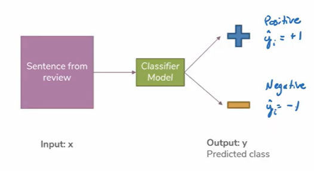
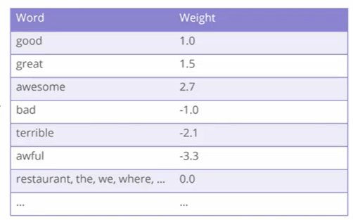
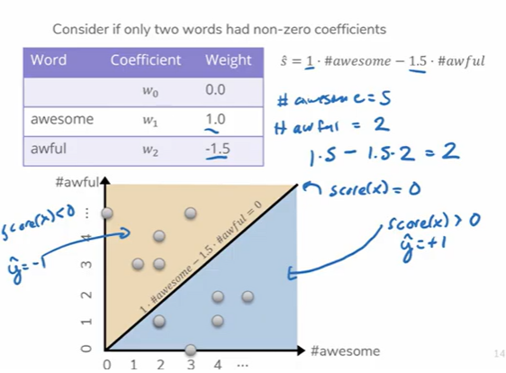
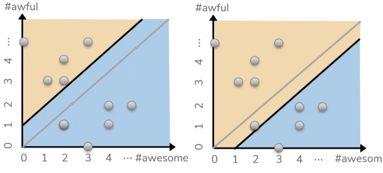
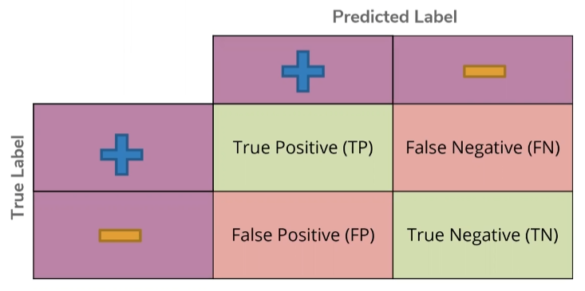
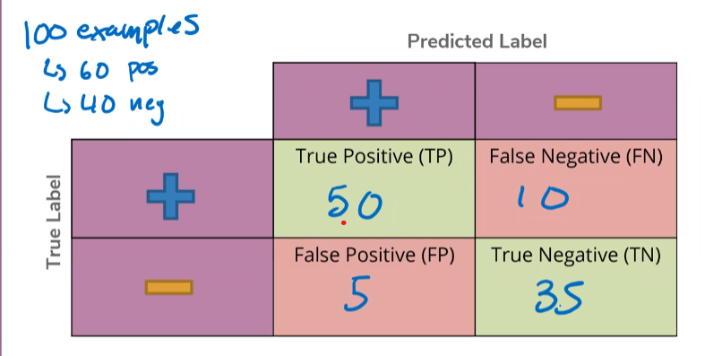
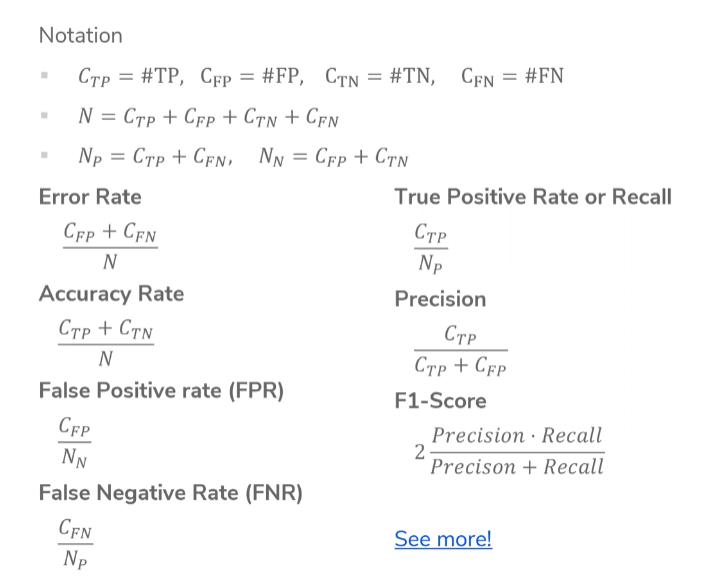
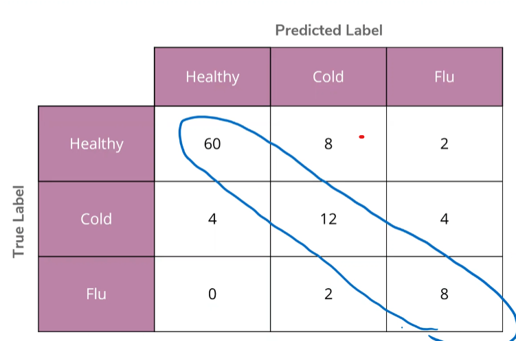

# Prelecture 5 - Classification Overview
In regression, the input to the model is numbers, and the output is a number. This works for a wide number of cases, but what if the thing we want as output isn't an number? For instance, what if we want to categorize something as good or bad, dog or cat, or blue or orange?

These tasks are known as classification tasks. Generally, they involve categorizing an input as one or more discrete values. For instance, an email filtering program that categorizes emails as spam or not spam.

| Task | Type of Classification |
| - | - |
| Spam or Not Spam Filter | Binary Classification |
| Object Detection | Multiclass Classification |

## Sentiment Classifier: Restaurant Reviews
What we're going to be doing is building a sentiment classifier to rate restaurant reviews.



Some input will be had (the review) and an output (from -1 to 1, from negative to positive) will be output. Here are a few naive ways to perform this.

### Simple Threshold Classifier
Count the number of positive and negative words. Return whichever positive or negative words were greater.

```py
count_positive = countPositive(review)
count_negative = countNegative(review)
return count_positive > count_negative ? 1 : -1
```

This runs into issues, because we'd need a way to classify words themselves as positive or not, and sometimes there are words that can seem positive at first but actually be negative (not good, isn't great).

To attempt resolving these issues, we can try to create a word classifier to determine the positivity of words, and get into using unigrams vs. bigrams. We won't go into NLP too much, but it is a thing.

### Linear Classifier
Instead of counting words, we can sum up words with weights attached depending on how positive or negative they are.



We can learn those weights later. If we have this table, we can sum up the weights of all the words in the review, and output a score.

> `Score = Sum(Sentence.Words -> Weight(Word))`

Then we return:

```py
score = sum(sentence.forEach(word -> {
    return word.weight
}))
return signum(score)
```

For future reference:

> `s = score(x)`
> `y = sign(s)`

| Symbol | Description |
| - | - |
| `s` | Score |
| `y` | Output |

## Decision Boundaries
When deciding the positivity/negativity of words, we need to decide what rules a negative word, to place all negative words below that and all positive words above that. The line that divides the positive from the negative is the decision boundary.



# Lecture 5 - Classification
For our case study, we'll be classifying restaurant reviews as either positive or negative.

Going back to our discussion about decision boundaries, what happens when we move the decision boundary up or down?



It turns out that moving the decision boundary up or down changes all the scores of any sentence. For instance, a sentence originally given a score of 2.0 might be given a new score of -1, or 0. This is because more words that the sentence contains might fall below the boundary if we move the boundary up.

More complex decision boundaries are covered next lecture, which allows for non-linear boundaries to take form.

## Evaluating Classifiers
Before we begin training a model, how do we actually determine if a model is good or not?

### Classification Error
In **classification error**, the number of times our model misclassifies an example (calls something negative when it was positive, or vice versa) divided by the total number of examples is our error.

> `Classification Error = n incorrect / n examples`

This error can also be converted to **classification accuracy**.

> `Classification Accuracy = 1 - Classification Error`

For binary classification, we should aim to have at least 0.5 accuracy, because that's the equivalent of random guessing. For higher power classifications, aim to have a prediction better than random guessing:

> `Goal Accuracy >= 1 / k`

Where `k` is the number of classes. But what if our accuracy is too high?

### Too High Accuracy: Evaluating Accuracy of Models
If we made a spam filter that marked every email as spam, we'd achieve 90% accuracy. This is because 90% of all emails are indeed spam, but that reminaing 10% is the important part.

This 90% is the **majority class classifier** of emails, meaning they compose the majority of examples. Having a high majority class leads to **class imbalance**. Whether or not a high accuracy is good or not depends on the context of the problem. For instance, a cancer detection model with a 90% accuracy is pretty good.

This process of using a majority class classifier (just classifying everything as the majority class) is a good sanity check when creating models. For instance, if you make a super fancy model that achieves 95% accuracy, and a majority class classifiers achieves 90%, all the suddent 95% isn't so impressive.

Therefore, when assessing accuracy:
* Is there a class imbalance that can affect the meaning of accuracy?
* What does my application need? What happens if it makes a mistake?

## Confusion Matrices
In binary classification, there are two ways of being wrong and two ways of being right. These are outlined as follows:



Along the side is the true label, along the top is the prediction. When a positive example is labeled positive, we get a true positive. When a negative example is labeled positive, we get a false positive. So on and so forth.

We can use this matrix and categorize the predicitons our model makes into the various categories. This gives us some insight into what kinds of errors the model is making.



In the example above, we predicted positive on 50 positive examples, but predicted negative for 10 of them. We predicted 35 negatives on negative examples, but 5 negatives on positive examples. By dividing the number of correct answers divided by all answers, we get an accuracy of 85%.

## Error Consequences
The consequences of different types of errors is up to the application. For instance, an email spam filter that produces false negatives (flags a spam email as not spam) can be annoying, but a false positive (flags a non-spam email as spam) loses emails. What kind of error you choose to minimize is up to you.

## Binary Classification Measures
An overview of the classification measures is as follows:



## Multiclass Confusion Matrix
To use confusion matricies in multiclass classification, add more rows and columns. The diagonal represents the correct predictions.

