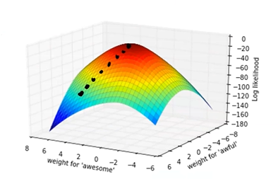

# Prelecture 6 - Logistic Regression
The way we treat error in classification can't be the same as it is in linear regression, since error in classification isn't continuous. That is, we can't use gradient descent since there is no "slope of error" to roll down.

Therefore, we need to change how the problem is defined. Instead of defining a positive or negative review as 1 or -1, we can assign a probability that is is positive.

| Review | True | Prediction |
| - | - | - |
| "The sushi was great! | Positive | 0.95 |
| "Everything was okay." | Neutral | 0.45 |
| "Sucked." | Negative | 0.05 |

Essentially, we're changing the problem to *"how likely is it that this review is positive?"* Once we have that, we can rate any prediction above 0.5 as positive and below 0.5 as negative.

We can then use our score function and map them to a probability that they are positive. In fancy statistical terms, that means:

The mapping function is known as the sigmoid function. Don't worry about it too much.

Basically, the more negative `x`, the closer to `0`. The more positive, the closer to `1`.

> `as x -> -infinity, sigmoid(x) -> 0`

> `as x -> infinity, sigmoid(x) -> 1`

Using this, we can plug in scores to get their probabilities.

> `True Prediction = Sigmoid(Score(x))`

# Lecture 6 - Logistic Regression
Once we have our new error modeling function, we can come up with a new quality metric, and start to train our classifier.

Our quality metric should tell us how likely our current weights will result in the correct labels for each of our examples. In other words, we want to find weights `w` such that our `sigmoid(Score(x))` is as close to `sigmoid(label(y))`

In English, that means our quality metric will tell us how close our weights get our predicted probabilities to their true probabilities, for all examples. This is known as maximizing **likelihood**.

In reality, we usually use the log of likelihood, so that computers don't blow up in our faces with floating point errors.

Or if you want to be really fancy about it, we can split examples into positive or negative cases:

## Finding Maximal Likelihood
Our likelihood function is something we that is continuous, and as a result, we can perform calculus on it. But because we're maximizing it, we're going to use gradient ascent rather than descent. It's basically the same thing in reverse.

> `w = w + n * gradient(w)`

## The Step Size Parameter N
The step size, or learning rate is a hyperparameter that controls how far each step is taken in gradient ascent or descent. Basically, for each adjustment that a gradient movement takes, how large of a step should be taken?

Different settings of this result in different training patterns. A smaller `n` may take forever to converge, a larger `n` can result in haphazard training.

If `n` is too large, you can actually diverge, as the adjustment is the product of both the slope and `n`. Essentially you miss the optimal point so much that it grows out of control.

In practice, we can use `n` that changes as training iterations continue.

> `n = n / t`

Where `t` is the training step, and another hyperparameter.

## Grid Search and Hyperparameter Tuning
Now that we have both `l` and `n` as our hyperparameters, we need to train all combinations of all hyperparameters to find the optimal model. This is what most of the time in machine learning is spent on.

## Overfitting in Classification
Just as in linear regression, we can increase our complexity to create more interesting models.

Linear.

Squared.

And beyond.

As more complexity is added, a sort of overfitting occurs. Therefore, again, the complexity of the model may decrease training error, but increase test error in the long run.

In classification, as overfitting begins, the sigmoid function becomes sharper, and there are fewer values between 0 and 1.

To fix this, we can use regularization, as we did in linear regression.

