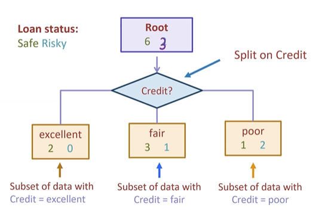
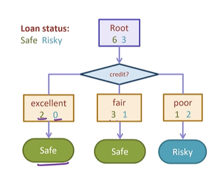

# Prelecture 7 - Naive Bayes and Decision Trees
Recall that in a classifier task, we're trying to get an estimate as to how likely (a percent) a given input should be classified as a certain output.

## Naive Bayes
Naive Bayes is an alternate model of classification. Naive Bayes still attempts to classify a given input (for instance, a restaurant review) as a given classification (positive or negative). Naive Bayes attempts to predict how likely a given input is to be found in a positive sentiment or a negative sentiment, based on the Bayes rule.

In short, it asks that for either all positive or all negative sentences, how likely is it that we'd find this sentence in that set? (Don't think too hard about it.) In practice, we usually drop the denominator, since we don't really care about the actual value of Bayes Rule and are just comparing the two values of either positive likelihood and negative likelihood.

The naive part of the Naive Bayes approach is that we assume that for any given sentence, the words that it contains are separate and individual from each other. Therefore, we break the sentence into its tokens and calcualte their probabilities.

So in short, Naive Bayes attempts to classify a sentence based on how likely its words are likely to be found in either a positive or a negative review.

> `y = probability(sentence) * probability(positive)`

Where `probability(positive)` is the chance of seeing a positive review in all reviews. In short, the ratio of positive reviews to all reviews.

One caveat is that if a certain feature becomes 0, the entire thing will become 0. So, either you take the log of the product, and make the assumption that log(0) == 0, or use Laplacian Smoothing, which always assigns a minimum value to each product.

Bayes is a simpler and generally easier to train model compared to Logistic Regression. They are examples of two different classes of Machine Learning models.

Naive Bayes is a **generative** classifier of Machine Learning, where we try to learn the rules for what generates a given input. These can lead to better understanding of data.

Logistic Regression is a **discriminative** classifier, where we aim to draw boundaries between inputs. These are generally more accurate.

# Lecture 7 - Decision Trees
Decision Trees are a discriminative model that aims to use a series of decisions to come to an output. Examples in real life are flowcharts.

## The XOR Problem
In classification, a common problem we have is that a linear classifier cannot capture an XOR environment very well.

Decision Trees are a different method that can alleviate the problem. For today's purposes, we're going to use decision trees to make loan risk assessments.

## Decision Trees and Loan Applicants
Given someone's loan application, how should we determine whether they should get a loan?

A decision tree model will be able to explain what decisions it makes. Imagine we have a certain input set, that looks like this:

The goal is to learn a flowchart that can fit this dataset to their outputs. That might look like this:

Nodes that output to another node are branch or internal nodes. Leaf nodes are nodes that have no children.

## Growing Trees Greedily
To grow a tree, we need to identify:
* Which features are positively correlated
* When to stop training

To do this, split the dataset in stages. For instance, first, we might split on credit.

We can then define a decision stump and make a prediction based on that one leaf. We use the majority class for the classification.

## Selecting the Best Features to Split
Once we do this for all features, we choose the one that has the lowest classification error. 

This feature then becomes the first branch on our decision tree. We stop at a certain node once a node hits 0 classification error.

For the other branches, we continue splitting the data on all other features.

Eventually, we get to the point where it makes more sense to stop the tree at a certain level, to prevent overfitting.

## Handling Continuous Data
When dealing with continuous data (for instance, income), we might decide a split on a certain threshold. For instance, split on income >= $60,000.

Problematically, there are an infinite number of thresholds to use, but helpfully, a fininte number of useful ones. Therefore, each threshold tried should be at a midpoint between two adjacent datapoints.

You can also elect to split the same continuous feature, so long as it still reduces classification error.

Later, we'll discuss how to prevent tree overfitting, and ensemble methods.