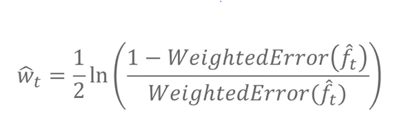

# Prelecture 8 - Ensemble Methods, Bagging
So far, we've been using single models to create predictions from outputs. Ensemble methods combine several models to create predictions. The two main methods of doing this are **bagging** and **boosting**.

## Bagging and Random Forests
Imagine you have `t` Decision Tree models, named appropriately the forest. Training each tree individually, combine their predictions and use the class majority as the prediction.

To train these trees, take random subsets (with replacement) of the data and train a tree on each one. This is referrred to as **bootstrapping**. Some versions of random forests also choose subsets of columns to introduce further randomness.

When performing bagging or boostrapped samples, we actually want to use overfit trees, because we have many trees that will be averaged out. By increasing the complexity of the trees, we decrease overall bias.

Microsoft actually uses the random forests method for pose estimation for the Xbox Kinect.

Random forests, in general:
* Uses overfitting to our advantage
* Is versatile, works in lots of cases
* Is low-maintenance, requires less hyperparameter tuning
* Are efficient, since each tree can be trained in parallel

# Lecture 8 - Ensemble Methods, Boosting
In the early days, when Machine Learning was primitive, models that performed slightly better than random chance were referred to as **weak learners**. Kearns and Valiant in the late 1980s put together a bunch of weak learners together to create a strong learner.

AdaBoost, the algorithm they came up with, is similar to random forests. But instead of using a bunch of trees, we use stumps. Each stump will get a weight associated with it, and the final output is a weighted majority vote.

An example, illustrated:

## Training AdaBoost
In AdaBoost, each model in the forest will be trained sequentially. The errors of one model will affect the training of the next model. To perform this, we need to keep track of:
* The weight a model, dependent on how good this model is at discriminating
* The weights of each example, dependent on how hard an example is to classify

To train a model:
* Find a stump on a certain feature
* Calculate its classification error
* Assign more weight to rows where mistakes were made, so that future models will focus more on them

Now models will be penalized for making mistakes on hard examples. Once we have the new example weights, we can also calculate the model's weight as well.

The equation behaves such that a model with a 0.5 error will receive 0 weight. Anything with lower error gets more positive weight, and anything with higher error gets more negative weight. Once we have this weight, we can then calculate the updated weights of the examples.

This equation adjusts the weight of the example based on whether or not the model got it correct or not.

In the real world, weights are usually normalized, such that all weights = 1. The entire process goes:

With AdaBoost, generally, as more trees are added, the training error decreases and test error decreases to a point. After that point, it begins to plateau, meaning it doesn't tend to overfit. Therefore, to choose the number of trees to use, you can find a T that minimizes validation error, and do cross validation.

In practice, AdaBoost was industry standard, used in practices like facial recognition. Recently deep learning has been taking over, but it has historically been one of the most successful techniques available. For alternative methods, see **Gradient Boosting**. It's also inherently sequential, which means it's slower than random forests.