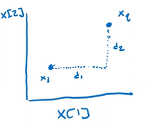
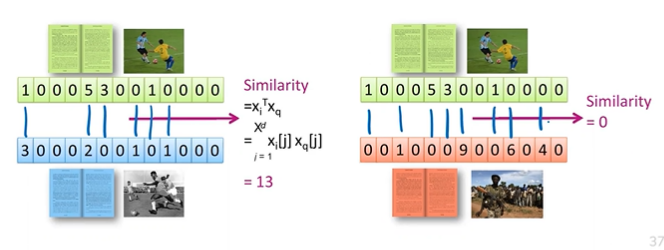
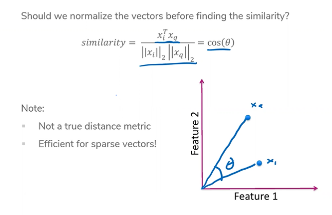
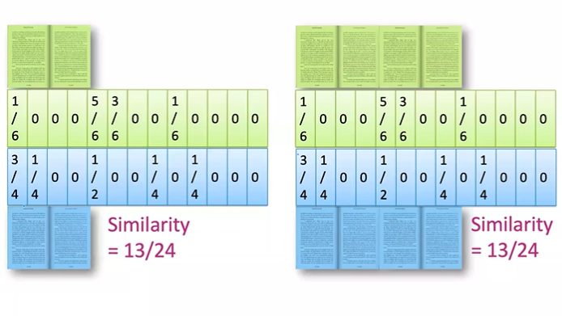

# Lecture 9 - Nearest Neighbors and Embeddings
## Checkpoint
So far, we've been over:
* Regression
* Classification

Both of which are *supervised learning* tasks. In other words, the datasets we've used for training all have labels. But in the real world, we might not have the labels of data. This is the realm of *unsupervised learning*.

## Case Study: Document Retrieval
For unsupervised learning, we're going to try to find out how similar a given book is to another book. Today, we're going to define the concepts of **embedding** and **similarity metrics** to find the **nearest neighbor**.

## Nearest Neighbors
Let's assume for a second that we have a way of embedding a book in a space, such that we can represent a book as `x`. Once the book has a position in an n-dimensional space, we can find the next book that is closest to that book.

```nearest_x = mindist(target, books)```

Iterating through all books could be slow if `books` is super large. This is the `1-nearest neighbor` approach, but if you want, you can find the `k-nearest neighbors` using a similar approach. Do some algorithm work, you get it. **k-nearest neighbors** can be used in several circumstances, including regression and classification.

## Embeddings
In almost all ML implementations, we feed numbers into a model. Sometimes we transform categorical data into numbers, but in general, we refer to this process as *vectorization*. In other words, we represent examples as *vectors of numbers of n-dimensions*.

When we have these vectors, we have a point that we can plot in a space. Once we have many points in space, we can find geometric patterns that uncover some meaning. This should sound familiar, since this is basically how classification worked.

The simplest version of this process is the *bag-of-words* approach. Similar to what we did in sentiment classification, we simply make a dimension for each word in a vocabulary, and each element is the number of times that word appears in a given document.

```
Given vector = [#a, #b, #c ... ]

"aaabbc" = [3, 2, 1]
"aabbcc" = [2, 2, 2]
"a" = [1, 0 0]

...
```

State of the art systems will have other machine learning systems to come up with the embeddings for you. It's machine learning all the way down.

*Bag of words* approach usually is helpful for being simple to understand and simple to implement, but suffer because very common words are overrepresented (the, a) and ends up having very uncommon words define documents (YouTube).

## Term Frequency Inverse Document Frequency
TF-IDF aims to alleviate these problems by scaling the counts of words based on how common they are in the entire corpus. This ends up giving us a weighted vector of counts that corresponds to how uncommon a word in *in proportion* to the entire corpus.

```
term_freq = count(word)
inverse_doc_freq = log(# docs / 1 + # docs using word)
tf_idf = term_freq * inverse_doc_freq
```

The 1 is to avoid divide by zero error, a smoothing technique.

## Calculating Distance
We're going to operate under the assumptions of *Euclidian distance*. Basically, the shortest distance between two points will be the straight line that connects them.

```
euclidian_dist = sqrt((x - y) ** 2)
```

Another distance metric is the *Manhattan Distance*. It is defined as the difference of the absolute differences of each point.

```
manhattan_dist = abs(x - y)
```



Which distance you use is a hyperparameter. Other distances include *weighted euclidian distance*, where differences in different dimensions are weighted differently.

## A Similarity Metric
If instead you want a measure of similarity and not difference, you can do a product similarity by multiplying each element by its counterpart. Bigger score means more similarity.



Cosine similarity measures the difference in angle.



Useful when using sparse vectors, but not a true distance metric.

## Normalization
By the nature of counting words, larger documents can have larger similarity scores just by having more words, even if they aren't that similar compared to two very short documents. Therefore, we can divide the score similarity by the total number of words in the document to get a normalized score.



This doesn't always make sense when the length of a document is a consideration in similarity. When a compromise is needed, a cap on the count of words can be used.