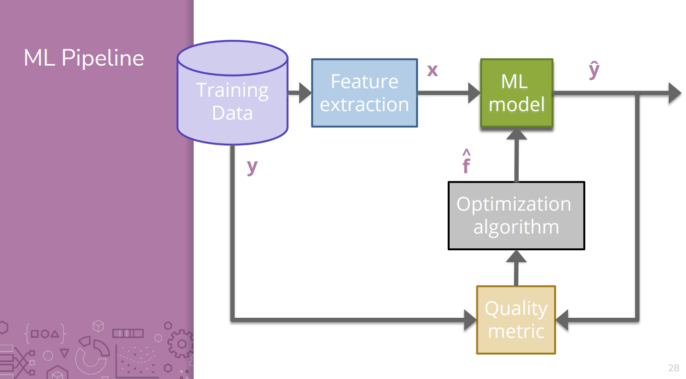
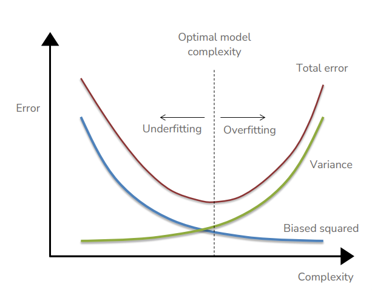
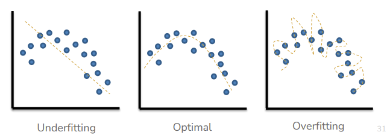

# Reflection 1
## Summary
In the introductory week to CSE 416, we went over class logistics, the ML pipeline, linear regression, and model complexity. These items have to deal with how we might train a machine to determine a function to predict an expected value from a training set of data, and how aggressive we want the function to be.

## Concepts
### The ML Pipeline
The ML pipeline outlines the general process for creating an ML algorithm from training data in a supervised learning environment.

### Linear, Poly Regression
The act of fitting a function to data points, with some degree of complexity.

### Optimization
Reducing the error a model produces when creating predictions.

### Complexity
How many parameters are used in a model, affecting its fitness.

## Uncertainties
* How might we use regression in places where our input data might not be numeric?
* How might we use regression in places where we don't have all of our required inputs?